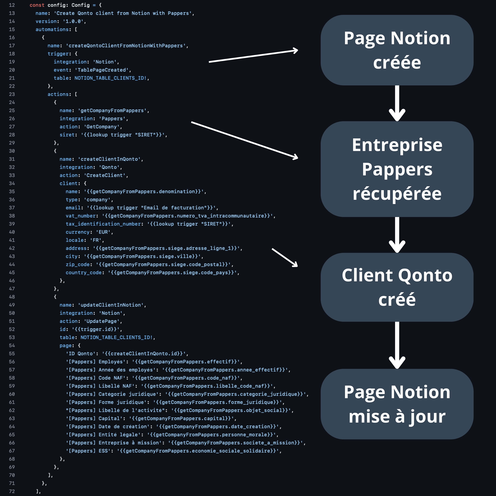

# La Tech Force Engine

Engine is a NPM package that generate a web application from a JSON configuration.

## Requirements

We use [Bun](https://bun.sh/) 1.2 or later to run the engine.

## Installation

Install the engine in your project like any other NPM package:

```bash
bun add @latechforce/engine
```

## Usage

Create a new file `index.ts` and import the engine:

```ts
import App from '@latechforce/engine/bun'

const app = new App()

const { url } = await app.start({
  name: 'My App',
  version: '1.0.0',
})

console.log(`App is running at ${url}`)
```

## Starter Kit

We recommend you to use our [starter kit](https://github.com/latechforce/engine-starter-kit) to start a new project.

## Configuration

You can configure your app from a JSON object. This object contains the configuration of the tables, automations, drivers, integrations, forms, etc...

You can [explore the configuration here](https://json-schema.app/view/%23?url=https%3A%2F%2Fraw.githubusercontent.com%2Flatechforce%2Fengine%2Frefs%2Fheads%2Fmain%2Fschema%2Fapp.schema.json).

We invite you to navigate into the [`examples/`](https://github.com/latechforce/engine/tree/main/examples) folder to see some examples.

## Examples

You can find some app examples in the [`examples/`](https://github.com/latechforce/engine/tree/main/examples) folder.

### Hello World

Go to the [`examples/hello-world`](https://github.com/latechforce/engine/tree/main/examples/hello-world) folder, install dependencies, and start hacking:

```bash
cd ./examples/hello-world
bun install
bun start
```

Then, you can edit the JSON configuration in the `index.ts` file:

```ts
import type { Config, CodeRunnerContext } from '@latechforce/engine'
import App from '@latechforce/engine/bun'

const config: Config = {
  name: 'Hello World Example',
  version: '1.0.0',
  automations: [
    {
      name: 'helloWorld',
      trigger: {
        service: 'Http',
        event: 'ApiCalled',
        path: 'hello-world',
        input: {
          type: 'object',
          properties: {
            name: { type: 'string' },
          },
        },
        output: {
          message: '{{runJavascriptCode.message}}',
        },
      },
      actions: [
        {
          service: 'Code',
          action: 'RunTypescript',
          name: 'runJavascriptCode',
          input: {
            name: '{{trigger.body.name}}',
          },
          code: String(async function (context: CodeRunnerContext<{ name?: string }>) {
            const { name = 'world' } = context.inputData
            const { logger } = context.services
            const {
              lodash: { capitalize },
            } = context.packages

            const message = `Hello ${capitalize(name)}!`
            logger.info(message)

            return { message }
          }),
        },
      ],
    },
  ],
  server: {
    port: 3000,
  },
}

await new App().start(config)
```

You can find the Open API documentation at [`http://localhost:3000/api/docs`](http://localhost:3000/api/docs).

You can test the API at [`http://localhost:3000/api/docs#tag/automation/POST/api/automation/hello-world`](http://localhost:3000/api/docs#tag/automation/POST/api/automation/hello-world).

### Create Qonto Client from Notion with Pappers

Go to the [`examples/create-qonto-client-from-notion-with-pappers`](https://github.com/latechforce/engine/tree/main/examples/create-qonto-client-from-notion-with-pappers) folder, install dependencies, and start hacking:

```bash
cd ./examples/create-qonto-client-from-notion-with-pappers
bun install
bun start
```

Here is the workflow:



## Contributing

La Tech Force Engine is built and maintained by a small team – we'd love your help to fix bugs and add features!

We use the [Cursor IDE](https://www.cursor.com/) to write code. You can find some notepads templates in the `.cursor` folder.

You can read our [contributing guide here](https://github.com/latechforce/engine/blob/main/CONTRIBUTING.md) and our [code of conduct here](https://github.com/latechforce/engine/blob/main/CODE_OF_CONDUCT.md).

### Requirements

- [Bun](https://bun.sh/) v1.2.0 or later
- [Cursor](https://www.cursor.com/) editor

### Getting Started

Clone the project, install project dependencies, and start contributing:

```bash
git clone https://github.com/latechforce/engine.git latechforce-engine
cd ./latechforce-engine
bun install
bun run test:e2e
bun run test:unit
```

The `bun run test` and `bun run test:integration` commands will not work because they require private environnement variables.
You can run this tests by pushing a commit to the repository.

**Important**: You need to have docker installed on your machine to run the e2e tests (you can use [Docker Desktop](https://docs.docker.com/desktop/)).

### Scripts

- `bun run format` — Format the code using Prettier
- `bun run lint` — Validate the code using ESLint
- `bun run clean` — Remove the `dist/` directory
- `bun run build:schema` — Generate the JSON schema
- `bun run build` — Build the engine for production
- `bun run test:e2e` — Run the end-to-end tests with Bun
- `bun run test:unit` — Run the unit tests with Bun

### How to Update

- `bun upgrade` — Bump Bun to the latest version
- `bun update` — Update Node.js modules (dependencies)

## License

Copyright (c) 2024-present Thomas JEANNEAU, La Tech Force (thomas.jeanneau@latechforce.com). This source code is licensed under a Fair Use License found in the [LICENSE](https://github.com/latechforce/engine/blob/main/LICENSE).
